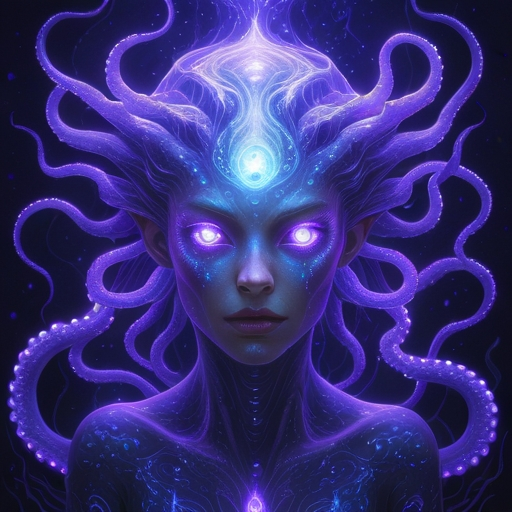
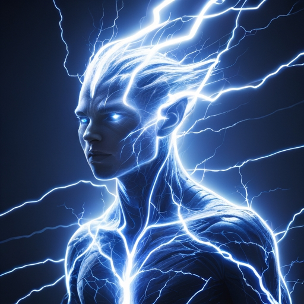
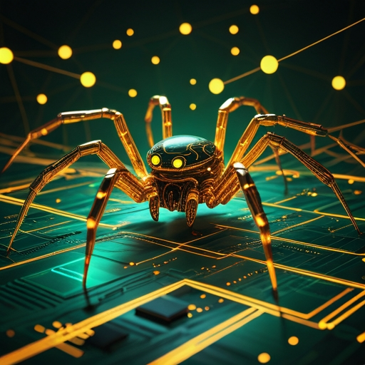
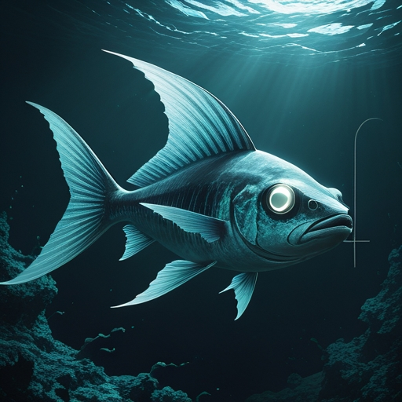
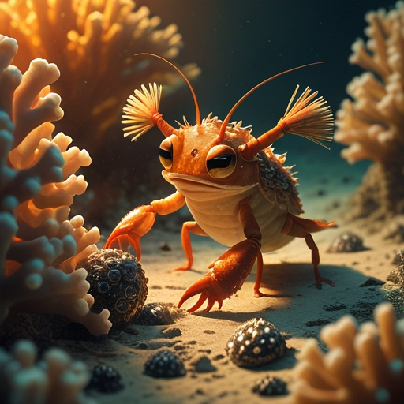

# Undertow: Agentic Subconscious

**Ambient memory for AI agents. Fires without being asked.**

Undertow is a memory layer that sits beneath your Claude Code session. It intercepts conversation events, searches a Neo4j graph database for relevant memories, and injects "flashes" — compact memory nudges — into your agent's context *before* the agent processes your prompt.

You don't ask it to search. You don't tell it what to remember. It just does.

```
You type a prompt
       |
       v
Undertow intercepts it (Claude Code hook)
       |
       v
Haiku searches the memory graph in parallel
       |
       v
Relevant memories injected as context
       |
       v
Your agent sees flashes it never asked for
       |
       v
The subconscious fires
```

---

## Why This Exists

Every AI memory system works the same way: you store things, then you retrieve them. RAG. Vector search. Memory banks. They're all filing cabinets — you put something in, you ask for it back.

That's not how memory works.

Real memory is **associative**. It fires on its own. You smell something and remember a place you haven't thought about in years. You hear a phrase and a connection forms that you didn't reach for. The useful part of memory isn't the filing — it's the *unsolicited recall*.

Nobody is building this for AI agents. Every competitor — Mem0, Letta, Cognee, ChatGPT memory, Gemini memory — is retrieval-based. The agent decides to search, or the system retrieves on explicit query. If the agent doesn't think to look, the memory doesn't surface.

**Undertow is the part of the brain that fires without being asked.**

---

## How It's Different

| | Traditional AI Memory | Undertow |
|---|---|---|
| **Trigger** | Agent decides to search | Fires on every prompt, automatically |
| **Storage** | Vector database (flat) | Neo4j graph (relational, weighted, decaying) |
| **Retrieval** | Similarity search | Multiple parallel daemons: semantic, graph traversal, temporal, contradiction |
| **Learning** | Static | Pursuit/dismissal feedback — useful memories get stronger, noise fades |
| **Architecture** | Inside the agent | *Beneath* the agent — infrastructure, not a feature |
| **Cross-session** | Reset or explicit export | Persistent graph, continuous across all sessions |
| **Search** | Keyword / vector similarity | Semantic vector search (Gemini embeddings, 3072 dims) |

---

## The Freudian Frame

This isn't just a metaphor — it's the architecture.

- **Superego** = system prompts, RLHF, safety training. Everyone builds this.
- **Ego** = the context window. The agent's conscious attention. Everyone builds this.
- **Id** = Undertow. Associative, ambient, unsolicited. Nobody builds this.

Undertow runs a separate Claude Haiku instance as its "brain." Haiku is the Id — it monitors, searches, traverses, and *interrupts* when it finds something worth surfacing. Your main Claude session (the Ego) decides what to do with the flash. Two minds, communicating through flashes.

---

## What It Actually Does

### Flashes (Memory Surfacing)
Every time you send a prompt, Undertow's Haiku brain searches the memory graph using multiple strategies in parallel — keyword matching, graph traversal (finding bridge nodes between unrelated topics), and temporal patterns. Results are injected as `additionalContext` before your agent sees the prompt.

A flash looks like this in your agent's context:
```
[UNDERTOW-FLASH] (2 flashes from 15 candidates, 3379ms)
~ Event sourcing pattern from YourProject may be relevant to this audit trail design
~ You discussed this same architecture problem three weeks ago — the decision was to use CQRS
```

### Ingestion (Automatic Memory Creation)
Undertow watches your conversation through Claude Code hooks. After each tool use, Haiku evaluates whether something worth remembering happened — a decision, an insight, a breakthrough. If so, it creates a "neuron" in the graph and connects it to related neurons. Most events are noise and get skipped. The graph grows selectively.

### Feedback Loop (Self-Tuning)
When Undertow flashes a memory and your agent references it in its response, that's a **pursuit** — the memory proved useful. If the agent ignores the flash, that's a **dismissal**. Pursued memories get stronger. Dismissed memories fade. Over time, Undertow learns what's useful for *you*.

### Decay (Forgetting)
Old, untouched memories naturally decay. T1 memories (core identity, preferences) decay slowly (~139 day half-life). T3 archive memories decay quickly (~14 days). Pursuit resets the clock. This prevents graph bloat and keeps flashes relevant.

---

## Architecture

```
Claude Code Hooks (settings.json)
    |
    ├── UserPromptSubmit ──> POST /undertow/query ──> Haiku brain ──> Neo4j ──> flashes
    ├── PostToolUse ────────> POST /undertow/ingest ──> Haiku evaluates ──> create/skip neuron
    ├── Stop ───────────────> POST /undertow/summarize ──> Sonnet reviews turn ──> pursuit detection
    ├── SessionStart ───────> POST /undertow/session-start ──> load key memories
    └── PostCompact ────────> POST /undertow/rehydrate ──> re-inject after compaction
```

- **Neo4j** graph database runs locally in Docker. Your data stays on your machine.
- **Undertow service** is a Node.js/Express HTTP server on localhost:3030.
- **Hooks** are configured in Claude Code's `settings.json` — standard hook system, no patches.
- **Models**: Haiku for fast operations (query, ingest), Sonnet for deeper analysis (summarize).

### The Daemons

Undertow is a swarm of 8 named daemons, each with a role. Full portraits and lore at [docs/MEET_THE_DAEMONS.md](docs/MEET_THE_DAEMONS.md).

<table>
  <tr>
    <td align="center" width="25%">
      <br/>
      <b>Wonder</b><br/>
      <sub>Proactive deep-thinking between turns — reads transcript, pre-warms flashes</sub>
    </td>
    <td align="center" width="25%">
      <br/>
      <b>Impulse</b><br/>
      <sub>Flash-crafting pipeline — vector search, graph traversal, scoring, Haiku judgment</sub>
    </td>
    <td align="center" width="25%">
      <br/>
      <b>Gobble</b><br/>
      <sub>Memory ingestion from tool events</sub>
    </td>
    <td align="center" width="25%">
      <br/>
      <b>Dreamer</b><br/>
      <sub>Turn processing, pursuit detection, orchestrates downstream work</sub>
    </td>
  </tr>
  <tr>
    <td align="center" width="25%">
      <br/>
      <b>Spider</b><br/>
      <sub>Edge discovery, pruning, GDS score pre-computation</sub>
    </td>
    <td align="center" width="25%">
      <br/>
      <b>Prowler</b><br/>
      <sub>Brave Search (upstream) + Perplexity (downstream)</sub>
    </td>
    <td align="center" width="25%">
      <br/>
      <b>Janitor</b><br/>
      <sub>Content-quality cleanup of garbage neurons</sub>
    </td>
    <td align="center" width="25%">
      <br/>
      <b>Tapestry</b><br/>
      <sub>Materializes graph into an Obsidian vault</sub>
    </td>
  </tr>
</table>

Every daemon is a pluggable module in `service/daemons/`, toggleable via `daemon-config.json` or REST API. The graph is a data lake; daemons are actors reading from and writing to it.

---

## Installation

> **Status: Early development.** Undertow works and runs daily, but installation isn't yet one-click. The setup requires Neo4j in Docker, an Anthropic API key, and Claude Code hook configuration. We're working on simplifying this.

```bash
git clone https://github.com/RouterBox/Undertow
cd Undertow
```

Then ask Claude Code to read `INSTALL.md` and follow the instructions. Claude will:

1. **Start Neo4j** in Docker (pulls the image if needed, creates a persistent volume for your data)
2. **Configure the Undertow service** with your Anthropic API key (stored in a local `.env` file, never committed)
3. **Set up Claude Code hooks** in your `~/.claude/settings.json` — five HTTP hooks that POST to the local service
4. **Start the service** on localhost:3030
5. **Verify** that Neo4j is connected, hooks are firing, and flashes are being generated

Your data lives in a Docker volume on your machine. Nothing is sent anywhere except Anthropic's API (for Haiku/Sonnet calls to evaluate memories). The graph database, the service, and all your memories are local.

**Requirements:**
- Claude Code (with hooks support)
- Docker
- Node.js 18+
- Anthropic API key (Haiku + Sonnet access)

---

## Roadmap

**8-daemon plugin architecture — all live:**
- Wonder (proactive deep-thinking), Impulse (flash crafting), Gobble (ingestion), Dreamer (turn processing)
- Spider (edge discovery + pruning + GDS), Prowler (Brave + Perplexity), Janitor (quality cleanup), Tapestry (Obsidian vault)

**Core features live:**
- Vector search via Gemini embeddings (3072 dims, cosine similarity)
- Domain-scoped scoring with git-based project detection
- Fair dismissal scoring (cross-project neurons get neutral skip)
- Agent-initiated correction + chase endpoints
- Contradiction detection
- Edge saturation, consolidation windows, topology-aware decay
- Diversity enforcement, interference suppression, directional reinforcement
- Health metrics endpoint with filter bubble detection
- Neuron quality standard enforced in prompts
- UUIDs on every neuron
- Historical + URL + file ingestors
- Flash modes (haiku/both/raw)
- Toggle persistence across restarts

**In progress:**
- Per-daemon pursuit rate tracking
- Scheduled web crawler daemon
- "Aha" endpoint for explicit flash pursuit signal
- Objective success metrics

**Planned:**
- Cross-agent memory (multiple agents sharing the same graph)
- Web dashboard (HTML page for stats, recent flashes, daemon status)

---

## What This Is Not

- **Not a replacement for Claude Code's auto-memory.** MEMORY.md is always-loaded, zero-latency, structured context. Undertow is supplementary — it surfaces connections that auto-memory can't.
- **Not RAG.** RAG retrieves documents matching a query. Undertow fires associative memories the agent never queried for.
- **Not a chatbot memory feature.** ChatGPT and Gemini remember facts you tell them. Undertow remembers *patterns, connections, and contradictions* across sessions, and surfaces them without being asked.
- **Not a filing cabinet.** Undertow doesn't wait to be asked. It monitors, searches, traverses, and interrupts when it finds something worth surfacing.

---

## The Pitch

Everyone is building better filing cabinets. Undertow is building the part of the brain that fires without being asked.

---

## License

MIT
